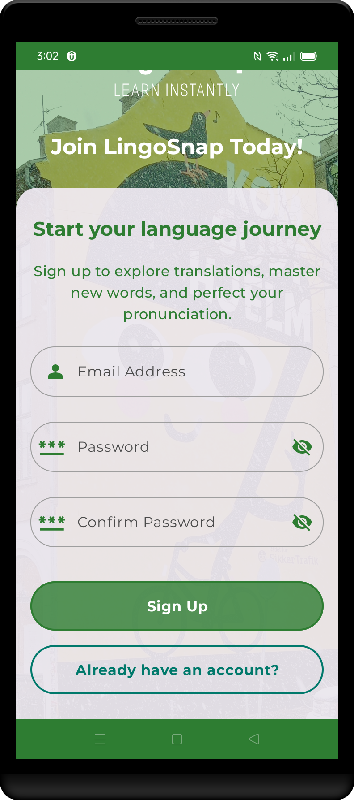

# LingoSnap 🌍📸🗣️  **Turn real-world text into language lessons.**  


LingoSnap is an AI-powered app designed to help you understand and learn languages naturally. Traveling abroad? Seeing a sign in a language you don’t understand? Take a photo and ask any question in your native language. LingoSnap will not only provide a translation but also explain key vocabulary and grammar concepts while guiding you through pronunciation. Every interaction is saved as a **LingoSnap**, allowing you to revisit it anytime for review.  

This app, **LingoSnap**, includes images and resources designed by [Freepik](https://www.freepik.com). We would like to thank Freepik for their incredible design resources. The images used in the app are provided with attribution, as required by Freepik's licensing terms. For more information on Freepik's resources, visit [www.freepik.com](https://www.freepik.com).

<p align="center">
  
  
  
  
  
  
</p>

<p align="center">
  
  
  
  
  
</p>

Slides are built using the  template from [Previewed](https://previewed.app/template/AFC0B4CB). I extend my gratitude to them for their remarkable work and contribution.

## 🚀 Unlock New Experiences with These Jetpack Compose Apps  

If you love innovation and high-quality mobile experiences, check out my other apps built with **Jetpack Compose**!  

### 🎨 [ArtNiche – NFT Art Marketplace](https://github.com/sergio11/art_niche_nft_marketplace)  
🖼️ A digital marketplace designed for artists and collectors. Buy, sell, and create NFTs in a seamless, intuitive experience.  

### 🌍📸 [LingoSnap – Learn Languages with AI](https://github.com/sergio11/lingosnap)  
🗣️ Turn real-world text into interactive lessons. Just snap a photo, and **LingoSnap** will teach you vocabulary, grammar, and pronunciation.  

### 🖼️ [Artify – Virtual Art Gallery](https://github.com/sergio11/artify)  
🏛️ Explore art with advanced technology. Discover details and context about artworks simply by capturing an image.  

### 👗 [ChicFit – Your AI Fashion Assistant](https://github.com/sergio11/chicfit)  
📸🤖 Get outfit suggestions and style recommendations powered by AI. Always look your best for any occasion!  

### 🔍📚 [Inquize – Capture Curiosity. Unlock Knowledge.](https://github.com/sergio11/inquize_android)  
💡 Transform your device into a gateway to knowledge. Just point your camera at an object, place, or concept, and **Inquize** will provide real-time answers, turning curiosity into a learning experience.  

## 🚀 Key Features  

- **Instant Photo Translation** 📸🌍: Capture images of signs, menus, or texts in any language and get an accurate translation.  
- **AI-Powered Learning Assistant** 🤖📚: Ask questions in your native language and receive detailed explanations about vocabulary and grammar.  
- **Pronunciation Guide** 🔊🗣️: Learn how to pronounce words and phrases detected in the image.  
- **Saved Conversations (LingoSnaps)** 📖💾: Every interaction is stored so you can review it later and reinforce your learning.  
- **Personalized Learning Path** 🎯📖: The app suggests lessons and repetitions based on your previous queries and comprehension level.  
- **Multi-Language Support** 🌎: Supports multiple languages for translation and learning.  

## 🧠 How LingoSnap Works  

- **Firestore** 🔥📂: Stores LingoSnaps (conversations) and each user’s learning history.  
- **Firestorage** 🗄️📸: Saves captured images for analysis and future reference.  
- **Gemini SDK** 🌟🤖: Analyzes images and responds with contextual translations and explanations.  
- **Speech Analysis** 🎙️🔍: Allows users to compare their pronunciation with native speakers.  

## 📱 Home Screen Features  

- **Quick Translate** 📷: Instantly translate text from images.  
- **Ask & Learn** 💬: Ask questions about the image and get AI-powered explanations.  
- **Saved LingoSnaps** 🔄📖: Access previous conversations and review lessons anytime.  

## ✨ Enhanced User Experience  

- **Optimized Performance** ⚡: Instant translations and responses with cloud processing.  
- **Intuitive UI** 🧭: Designed with **Jetpack Compose** for a smooth and modern experience.  
- **Smart Recommendations** 🤖: AI-based suggestions tailored to your progress.  

## 🛠️ **Clean Architecture & MVI for a Robust Foundation**

LingoSnap is built on **Clean Architecture** principles to ensure the app is scalable, maintainable, and testable, making it future-proof and easy to evolve. By following this architecture, we achieve a clear separation of concerns, with distinct layers for data, domain, and presentation. This design ensures that the business logic (language learning, translation, etc.) is isolated from the UI, making the app more modular and easier to modify or expand.

The app uses the **Model-View-Intent (MVI)** pattern for the UI layer. This pattern allows LingoSnap to maintain a **unidirectional data flow**, ensuring predictable behavior and a more stable and responsive user experience.

- **Domain-Centric Design** 🧩: All business logic related to language translation, pronunciation, and grammar analysis is encapsulated in the **domain layer**. The domain layer interacts with data sources (e.g., APIs, local storage) to manage the flow of information, ensuring the UI remains clean and responsive.
- **Seamless Integration with Gemini SDK** 🤖🌍: The Clean Architecture ensures that the integration with the **Gemini SDK** (used for natural language processing and AI-powered translation) is seamless and efficient. It powers LingoSnap’s core functionality, delivering high-quality learning experiences.

## 🧰 **Technologies Used**

LingoSnap is developed using modern technologies to ensure high performance, scalability, and a smooth user experience:

- **Kotlin** 💻: The primary programming language for Android development, chosen for its expressiveness, safety features, and compatibility with modern libraries.
- **Jetpack Compose** 🎨: A declarative UI toolkit for building user interfaces. It makes UI development simpler and faster while offering flexibility in designing interactive, dynamic layouts.
- **Gemini SDK** 🤖: The AI engine behind the app, providing advanced translation capabilities, pronunciation analysis, and context-sensitive feedback. It powers LingoSnap’s core functionality, delivering high-quality learning experiences.
- **Firestore** 🔥: A real-time database that stores user-generated content (like questions, answers, and learning insights). Firestore enables smooth syncing across devices and fast access to data.
- **Firestorage** 📸: Manages the storage of images uploaded by users (e.g., snapshots of text, hand-written notes, or objects), allowing LingoSnap to provide translations or language learning insights based on the content in these images.
- **Coroutines** ⏱️: Kotlin’s asynchronous programming tool that helps manage background tasks efficiently. Coroutines allow LingoSnap to perform time-consuming operations (like image processing or API calls) without blocking the main thread, ensuring a smooth user experience.
- **Hilt/Dagger** 🛠️: Dependency injection frameworks used for managing app components and their dependencies. Hilt ensures that modules are decoupled and scalable.
- **Retrofit** 🌐: Used for API interactions, particularly with external services that provide language data, translations, or other learning resources.
- **Coil** 🎨: An image loading library for handling image display, especially for the photos that users upload. Coil ensures efficient image loading and caching, helping the app maintain high performance.
- **Room Database** 🗄️: A local database solution for caching and storing user data, which allows LingoSnap to work offline and ensure that progress and insights are not lost when the user is disconnected.

## **Development with Brownie UI Library**

🍫 **Brownie**: [Jetpack Compose UI Library](https://github.com/sergio11/brownie_ui_library) 🚀

LingoSnap leverages **Brownie** to streamline UI development using pre-built components and best practices. Brownie facilitates state management and provides a consistent, flexible UI design, which is perfect for applications like LingoSnap, where a smooth user experience is essential.

### **Features 🎉**

- **Pre-defined Components**: Brownie provides a set of ready-to-use UI components, such as buttons, lists, and cards. These components ensure a consistent and polished visual design, reducing the amount of time needed to create screens.
- **State Management**: Brownie supports **MVI** or **MVVM** architecture, helping manage the UI state in a clean and reactive manner, which is crucial for apps like LingoSnap that involve real-time data and user interaction.
- **Customization**: Components can be easily customized to fit LingoSnap's visual style, ensuring that the app's UI remains unique and in line with its branding.
- **Jetpack Compose Compatibility**: Brownie components are fully integrated with Jetpack Compose, providing a smooth development experience and ensuring optimal performance.

### **Model-View-Intent (MVI) Architecture 🏗️**

Brownie promotes the use of **MVI** for effective screen state management. In this architecture:

- **Model**: Represents the current state of the UI. Brownie’s `BrownieViewModel` handles and manages this state, providing it to the UI components in a reactive way.
- **View**: Renders the user interface based on the state provided by the ViewModel. Brownie components seamlessly integrate with Jetpack Compose for smooth and dynamic UI rendering.
- **Intent**: Represents the actions or events that the user performs (e.g., asking for a translation, uploading a photo). These intents trigger state updates and initiate actions in the app.

For more information, visit the [Brownie UI Library on GitHub](https://github.com/sergio11/brownie_ui_library) and star it to show your support!

## App Screenshots

Here are some screenshots to showcase **LingoSnap**'s clean and intuitive UI, demonstrating how users can seamlessly interact with the app, take photos, and receive real-time translations and insights.

<p>
  
  &nbsp;&nbsp;&nbsp;
  
  &nbsp;&nbsp;&nbsp;
  
</p>

<p>
  
  &nbsp;&nbsp;&nbsp;
  
  &nbsp;&nbsp;&nbsp;
  
</p>

<p>
  
  &nbsp;&nbsp;&nbsp;
  
  &nbsp;&nbsp;&nbsp;
  
</p>

<p>
  
  &nbsp;&nbsp;&nbsp;
  
  &nbsp;&nbsp;&nbsp;
  
</p>

<p>
  
  &nbsp;&nbsp;&nbsp;
  
  &nbsp;&nbsp;&nbsp;
  
</p>

<p>
  
  &nbsp;&nbsp;&nbsp;
  
  &nbsp;&nbsp;&nbsp;
  
</p>

<p>
  
   &nbsp;&nbsp;&nbsp;
  
  &nbsp;&nbsp;&nbsp;
  
</p>

<p>
  
  &nbsp;&nbsp;&nbsp;
  
</p>


## Contribution
Contributions to LingoSnap are highly encouraged! If you're interested in adding new features, resolving bugs, or enhancing the project's functionality, please feel free to submit pull requests.

## Credits
LingoSnap is developed and maintained by Sergio Sánchez Sánchez (Dream Software). Special thanks to the open-source community and the contributors who have made this project possible. If you have any questions, feedback, or suggestions, feel free to reach out at dreamsoftware92@gmail.com.

## Acknowledgements 🙏

 - Special thanks to **technophilist** for the Perceive app, which served as a source of inspiration for this project. Visit [Perceive](https://github.com/technophilist/Perceive).

- We express our deep appreciation to [Freepik](https://www.freepik.es/) for generously providing the resources used in this project.

- <div> Icons and images takes from <a href="https://www.freepik.com" title="Freepik"> Freepik </a> from <a href="https://www.flaticon.es/" title="Flaticon">www.flaticon.es'</a></div>
- Template mockup from https://previewed.app/template/AFC0B4CB

 ## Visitors Count

 

 ## Please Share & Star the repository to keep me motivated.
  <a href = "https://github.com/sergio11/lingosnap/stargazers">
     
  </a>

## License ⚖️

This project is licensed under the MIT License, an open-source software license that allows developers to freely use, copy, modify, and distribute the software. 🛠️ This includes use in both personal and commercial projects, with the only requirement being that the original copyright notice is retained. 📄

Please note the following limitations:

- The software is provided "as is", without any warranties, express or implied. 🚫🛡️
- If you distribute the software, whether in original or modified form, you must include the original copyright notice and license. 📑
- The license allows for commercial use, but you cannot claim ownership over the software itself. 🏷️

The goal of this license is to maximize freedom for developers while maintaining recognition for the original creators.

```
MIT License

Copyright (c) 2025 Dream software - Sergio Sánchez 

Permission is hereby granted, free of charge, to any person obtaining a copy
of this software and associated documentation files (the "Software"), to deal
in the Software without restriction, including without limitation the rights
to use, copy, modify, merge, publish, distribute, sublicense, and/or sell
copies of the Software, and to permit persons to whom the Software is
furnished to do so, subject to the following conditions:

The above copyright notice and this permission notice shall be included in all
copies or substantial portions of the Software.

THE SOFTWARE IS PROVIDED "AS IS", WITHOUT WARRANTY OF ANY KIND, EXPRESS OR
IMPLIED, INCLUDING BUT NOT LIMITED TO THE WARRANTIES OF MERCHANTABILITY,
FITNESS FOR A PARTICULAR PURPOSE AND NONINFRINGEMENT. IN NO EVENT SHALL THE
AUTHORS OR COPYRIGHT HOLDERS BE LIABLE FOR ANY CLAIM, DAMAGES OR OTHER
LIABILITY, WHETHER IN AN ACTION OF CONTRACT, TORT OR OTHERWISE, ARISING FROM,
OUT OF OR IN CONNECTION WITH THE SOFTWARE OR THE USE OR OTHER DEALINGS IN THE
SOFTWARE.
```
